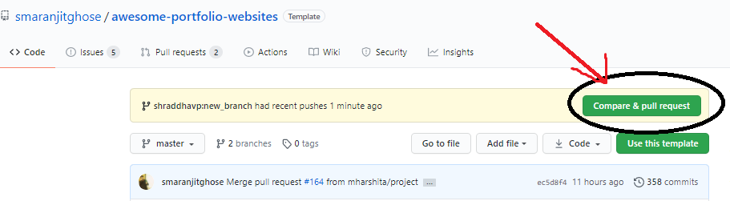
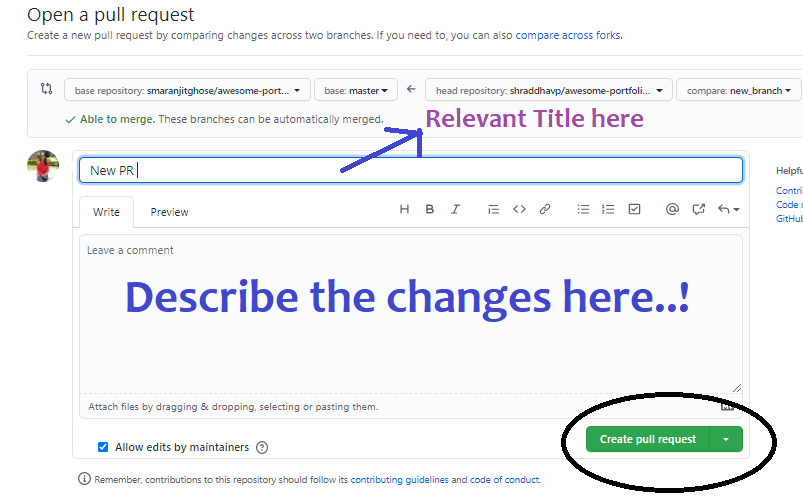

# Contribution Guidelines [](https://github.com/smaranjitghose/awesome-portfolio-websites/issues) 🤝🏽🍀:


<p align="center"></p>

We want to make contributing to this project as easy and as transparent as possible, whether it's:<br>

- Reporting a bug :bug:

- Submitting a fix :mag_right:

- Proposing new features :bulb:

If you wish to contribute to this project, please raise an issue and wait for the project maintainers to approve it or give feedback before making a change.

This documentation contains a set of guidelines to help you during the contribution process. We are happy to welcome all the contributions from anyone willing to improve/add new scripts to this project. 

## Code of Conduct

Make sure to read it here: [CODE_OF_CONDUCT.md](CODE_OF_CONDUCT.md)


## Preliminaries

- Download and install the latest stable version of [Git](https://git-scm.com/downloads) 📥 for version control
- Create a [Github](https://github.com/join) Account 📇
- Download and install latest stable version of [VS Code](https://code.visualstudio.com/download)

##   A. Setting up the Project

**1.**  Fork [this](https://github.com/smaranjitghose/awesome-portfolio-websites) repository.

<p align="center"></p>


**2.**  Clone your forked copy of the project.

```
git clone --depth 1 https://github.com/<your_user_name>/awesome-portfolio-websites.git
```
<p align="center"></p>

**3.** Navigate to the project directory :file_folder: .

```
cd awesome-portfolio-websites
```

**4.** Add a reference to the original repository.

```
git remote add upstream https://github.com/smaranjitghose/awesome-portfolio-websites.git 
```

**5.** Check the remotes for this repository.

```
git remote -v
```

**6.** Always take a pull from the upstream repository to your master branch to keep it at par with the main project(updated repository).

```
git pull upstream master
```

- Comment on any existing [issue(s)](https://github.com/smaranjitghose/awesome-portfolio-websites/issues) raised by **project maintainers**. Otherwise raise a [new issue](https://github.com/smaranjitghose/awesome-portfolio-websites/issues/new).

> ### Guidelines for raising a new issue:
>
> - Each issue should have an appropriate and short title like "Bug in Experience Page"
>
> - Whenever a participant raises an issue, by default it would be assigned to that participant due to obvious reasons. 
>
> - Be specific about your intended changes/suggestions
>
> - Refrain from using phrases like "Hi, I am ..", "Please assign me this issue", "Thank You..", etc. We are only interested in technical parts
>
> - Attach a screenshot/clip if applicable
>
> - Please be patient enough. The project maintainers/mentors would review it as per their schedule. Refrain from putting up comments like "Please check this" ,"Please review this PR" etc.
>
>-  An issue would be assigned to a participant for a minimum of 1 day and a maximum of 3 days. If the tenure of a particular participant is not over please do not spam the issue thread by writing, " I am interested" etc. You are welcome to do so if the participant has not met the requirements with around 12 hours remaining for their deadline.
>
> - Feel free to suggest your opinions on the already raised issues.
>
> - All participants are welcomed to suggest new features/bug fixes/improvements and raise new issues for those. However, the assignment would be done once approved by either of the project maintainers or the mentors.
>
> - Do not blindly comment on issues raised by other participant(s). Unless a minimum of 48 hours has passed since their assignment, the issue would not be re-assigned(excluding certain cases). The issue raised by a participant will always to be assigned to him/her by default. Do not spam "Interested", "Please assign me" in others issues.
>
> - Always keep a note of the deadline.

##  B. Contributing to the Project

- Once the project maintainer(s)/mentor(s) have reviewed the issue/assigned you the issue. Start working on the changes.

**1.** Create a new branch (DO NOT name it MAIN or MASTER or anything random).

```
git checkout -b <your_branch_name>
```

**2.** Perfom your desired changes to the code base.
- Make sure that you do not change any code unrelated to the task that you have been assigned

- Ensure that your changes apply to all screensizes

- Comment any new code addition(s)

- Do not mess up the directory structure

- Preview your changes and test them properly before proceding ahead

<p align="center"></p>

- Make a small clip or take screenshots before and after making changes.


**3.** Track your changes:heavy_check_mark: 

```
git add . 
```

**4.** Commit your changes .

```
git commit -m "Relevant message"  (usually title of the pull request)
```
- **Make sure to condense your changes into a single commit**.

**5.** Push the committed changes in your feature branch to your remote repo.

```
git push -u origin <your_branch_name>
```

**6.** To create a pull request, click on `compare and pull requests`. Please ensure you compare your feature branch to the desired branch of the repo you are suppose to make a PR to.



**7.** Then add an appropriate title and description to your pull request that explains your changes and efforts done.


**8.** Click on `Create Pull Request`.



> ### Guidelines for raising a pull request:
>
> - Each pull request should have an appropriate and short title like "Fixed Bug in Experience Page"
>
> - In case of multiple commits, please perform a rebase and make a squash commit before giving the pull request.
>
> - Pull Requests without a description would often not be reviewed. Make sure you describe your intended changes in the description section of the pull request. (Use bullet points and phrases)
>
> - Make sure to refer the respective issue in the respective PR using phrases like `Resolves #issue_number` or `Closes #issue_number`.  Here's an example to raise a PR:
```
 Fixes #640

# Work Done:

- Fixed Responsiveness bug in the MOOC Section of the Education Page
- Made the Favicon more optimized
- ...
- ...
- ...

# Relevant Screenshots/Gifs
```

> - Refrain from using phrases like "Hi, I am ..", "Please merge me this PR", "Thank You..", etc. We are only interested in technical parts.
>
> - Attach a screenshot/clip of the change(s).
>
> - Please be patient enough. The project maintainers/mentors would review it as per their schedule. Please do not start putting comments like "Please check this" etc.
>
> - Not every PR would be merged directly. In majority of the scenarios, we would be offering some additional suggestions which are to be incorporated in the same PR with a squash commit.
>
> - Look out for possible merge conflicts. Please add comments required, this makes your code readable.
>
>- Make sensible variable names. For example, card1 is quite ambiguous but education_card implies what that variable is declared for.
>
> - Although we support feedback from everyone in all phases of development, it is highly advised not to put any negative comments in other participant's pull requests.
>
> - Always keep a note of the deadline.


**9.** Voila :exclamation: You have made a PR to the awesome-developer-portfolio project :boom: . Sit back patiently and relax while the project maintainers review your PR. Please understand at times the time can vary from a few hours to a few days.

<p align="center"></p>

