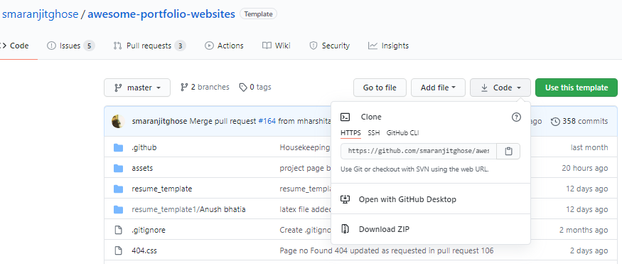

<h1 align="center"><b>Guidelines for Contribution</b></h1> 

<p align="center"></p>

We want to make contributing to this project as easy and as transparent as possible, whether it's:<br>

- Reporting a bug :bug:

- Submitting a fix :mag_right:

- Proposing new features :bulb:

If you wish to contribute to this project, please raise an issue and wait for the project maintainers to approve it or give feedback

<h2 align="center"><b>How to make a Pull Request? :point_down:</b></h2>

<p align="center"></p>

**1.**  Fork [this](https://github.com/smaranjitghose/awesome-portfolio-websites) repository.

**2.**  Clone your forked copy of the project.

```
git clone --depth 1 https://github.com/<your_user_name>/awesome-portfolio-websites.git
```


**3.** Navigate to the project directory :file_folder: .

```
cd awesome-portfolio-websites
```

**4.** Add a reference to the original repository.

```
git remote add upstream https://github.com/smaranjitghose/awesome-portfolio-websites.git 
```

**5.** Check the remotes for this repository.

```
git remote -v
```

**6.** Always take a pull from the upstream repository to your master branch to keep it at par with the main project(updated repository).

```
git pull upstream master
```

**7.** Create a new branch.

```
git checkout -b <your_branch_name>
```

**8.** Perfom your desired changes to the code base.

<p align="center"></p>

**9.** Track your changes:heavy_check_mark: .

```
git add . 
```

**10.** Commit your changes .

```
git commit -m "Relevant message"
```

**11.** Push the committed changes in your feature branch to your remote repo.

```
git push -u origin <your_branch_name>
```

**12.** To create a pull request, click on `compare and pull requests`. Please ensure you compare your feature branch to the desired branch of the repo you are suppose to make a PR to.


**13.** Then add an appropriate title and description to your pull request that explains your changes and efforts done.


**14.** Click on `Create Pull Request`.


**15** Voila :exclamation: You have made a PR to the awesome-developer-portfolio project :boom: . Sit back patiently and relax while the project maintainers review your PR. Please understand at times the time can vary from a few hours to a few days

<p align="center"></p>


# Open Source Program Grading


## [Script Winter of Code](https://swoc.tech/)

| Difficulty | Score |
|------------|-------|
| Beginner   | 10 |
| Easy       | 20 |
| Medium     | 30 |
| Hard       | 40 |

#### Allotment:

- Add relevant labels ( must contain `SWoC21`)
- Maintain an excel sheet: 

| Name | Username | # of Beginner | # of Easy | # of Medium | # of Hard | Total Score | PR Numbers |
|------|----------|---------------|-----------|-------------|-----------|-------------|------------|

## [Mexili Winter of Code](https://mexili.github.io/winter_of_code/#/)

#### Distribution

| Difficulty | Score |
|------------|-------|
| Easy   | 25  |
| Medium | 50  |
| Hard   | 100 |

#### Allotment:

When accepting the PR, add the following label before merging it. user=<username>:score=<score>, e.g. if the user sansyrox has filled a relevant PR and you are allotting 100 marks to him, add the following label ``user=sansyrox:score=100`` to the PR.
 
## [IEEE DTU Cross Winter of Code](https://crosswoc.ieeedtu.in/)

#### Distribution

| Difficulty | Score |
|------------|-------|
| Easy   | - |
| Medium | - |
| Hard   | - |

#### Allotment:

- Add labels to PRs
- Maintain a Contributor.MD for CrossWoC
