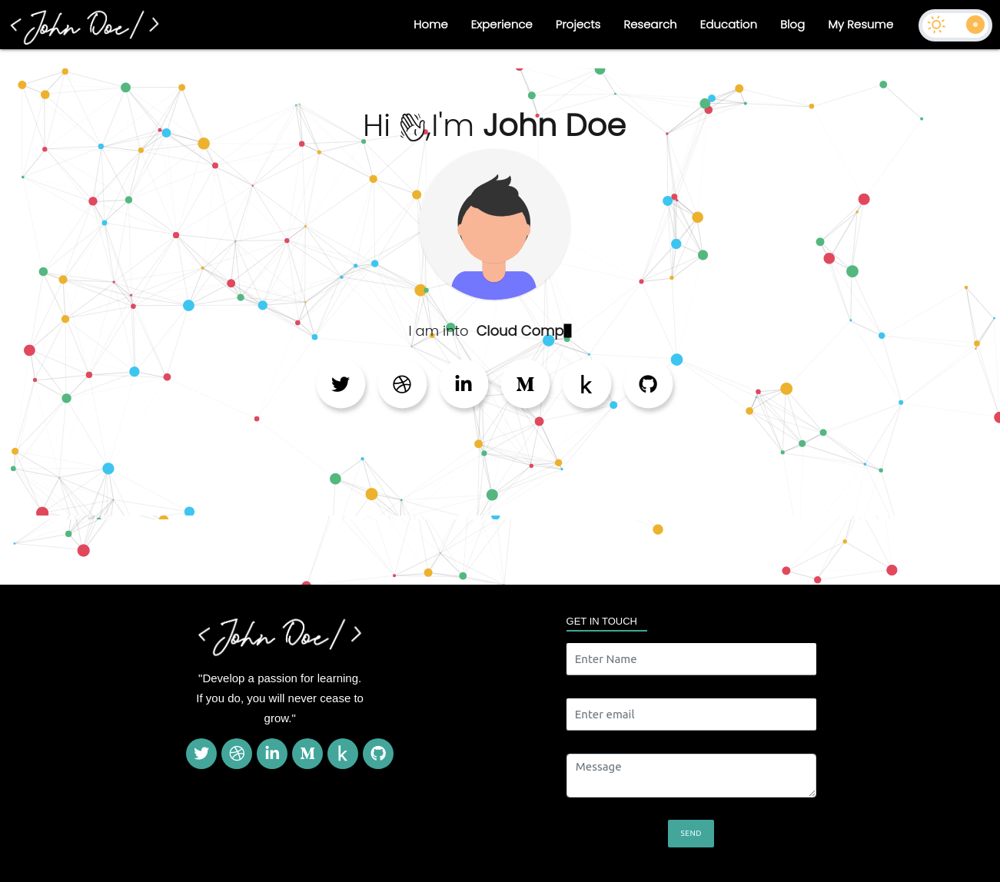
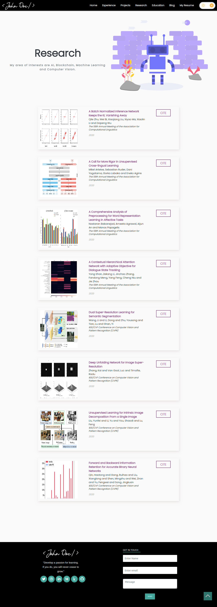

<h1 align= "center"><b>Awesome Portfolio Websites</b></h1>
An open source project for creating end-end templates for portfolio websites for everyone to use. We are a clan of geeks who wants to provide you with that dope website that flaunts your hardwork and projects over the years to your mates and employers! With a deep desire to have that satiating UserInterface, those engaging animations,the great SEO and the optimized code, we do it all. Hop in and give your contributions if you wish to be a part of this initiative.

### Snapshots:

<h2 align="center"> Home Page </h2>

<h2 align="center"> Experience Page </h2> 

<h2 align="center"> Project Page </h2>

<h2 align="center"> Research Page </h2>

<h2 align="center"> Education Page </h2>

<h2 align="center"> Programs we have been a part of: </h2>

### Made with 💖 for open source__

## **_In open source, we feel strongly that to really do something well, you have to get a lot of people involved._**

 <i> -Linus Torvalds </i> 

## How to use this?

[Link to Documentation](https://smaranjitghose.github.io/awesome-portfolio-websites//)

## The geeks🤓 behind this initiative!
  
 
### Project Maintainers:

&ensp;&ensp;&ensp;

<a href="https://github.com/smaranjitghose">
<h4 align="center"><b>Smaranjit Ghose</b></a>&ensp;&ensp;&ensp;&ensp;&ensp;&ensp;&ensp;&ensp;&ensp;&ensp;&ensp;&ensp;&ensp;
<a href="https://github.com/anushbhatia"><b>Anush Bhatia</b></h4></a>

### Contributors: 

<a href="./Code_of_conduct.md"><h2 align= "center"><b> Code of Conduct</b></h2></a> 

<a href="./LICENSE"><h2 align= "center"><b> License</b></h2></a> 

