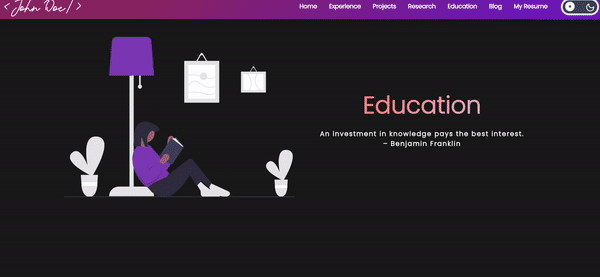
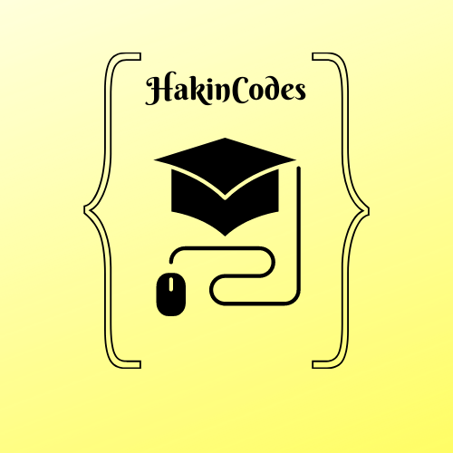

<h1 align= "center"><b>Awesome Portfolio Websites</b></h1> 

Are you a researcher, a developer or perhaps an explorer of technology who is looking forward to create an awesome personal brand?

Well writing blog posts, working on some cool projects/papers/designs are a great way to do so. But there is something that you might be missing out on!

So, what else do you need?🤔.

Here is the answer: An awesome personal website of yours that serves a portfolio of your work! 

If you do not have a platform that shows your entire work then you might not be doing justice in potraying your hard work or dope skills. But you must be wondering that making a portfolio website might take time, require some web development knowledge and still you might get something really 
cool. 

Well! Take a chill pill. Don't be intimidated by those thoughts. __Awesome Portfolio Wesbite__ is here for the rescue!

This is an open source project aimed at providing a free, full fledged template that anyone can use as a template to build and put out their website within an hour!. We take special care of the UI, SEO and all the cool stuff. This is possible to the hard work of our contributors and project maintainers. You just focus on putting your important info and expandinf your digital presence!

## A sneek peek into what we have here🙈 :

### Home Page:

### Experience Page:

### Project Page:

### Research Page:

### Education Page:

## How to use this?🛠

[Check out our awesome Documentation](https://smaranjitghose.github.io/awesome-portfolio-websites/)

## Contribution Guidelines🏗

Are we missing any of your favorite features, which you think you can add to it❓ We invite you to contribute to this project and make it better. To start contributing, please do refer to [this file](./CONTRIBUTING.md)

## The geeks🤓 behind this initiative:

#### Our hard working Project Maintainers👨‍🏫:

&ensp;&ensp;&ensp;

<a href="https://github.com/smaranjitghose">
<h5 align="center"><b>Smaranjit Ghose</b></a>&ensp;&ensp;&ensp;&ensp;&ensp;&ensp;&ensp;&ensp;&ensp;&ensp;&ensp;&ensp;&ensp;
<a href="https://github.com/anushbhatia"><b>Anush Bhatia</b></h5></a>

#### Our valuable Contributors👩‍💻👨‍💻 :

## Open Source Programs we have been a part of: 

 

## Code of Conduct

## License 

