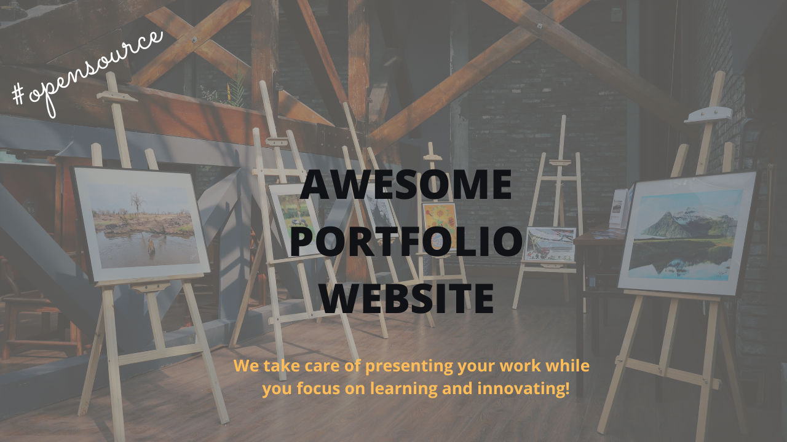
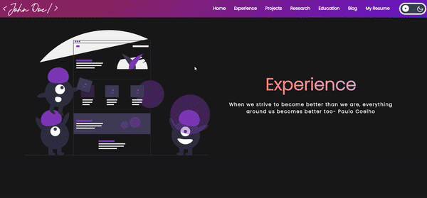
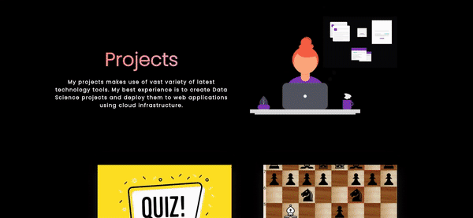
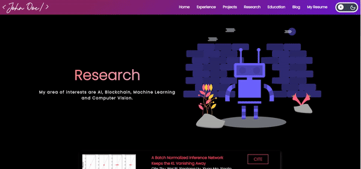
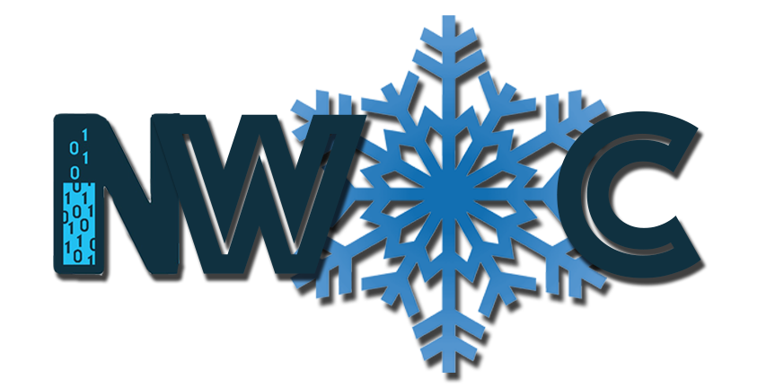
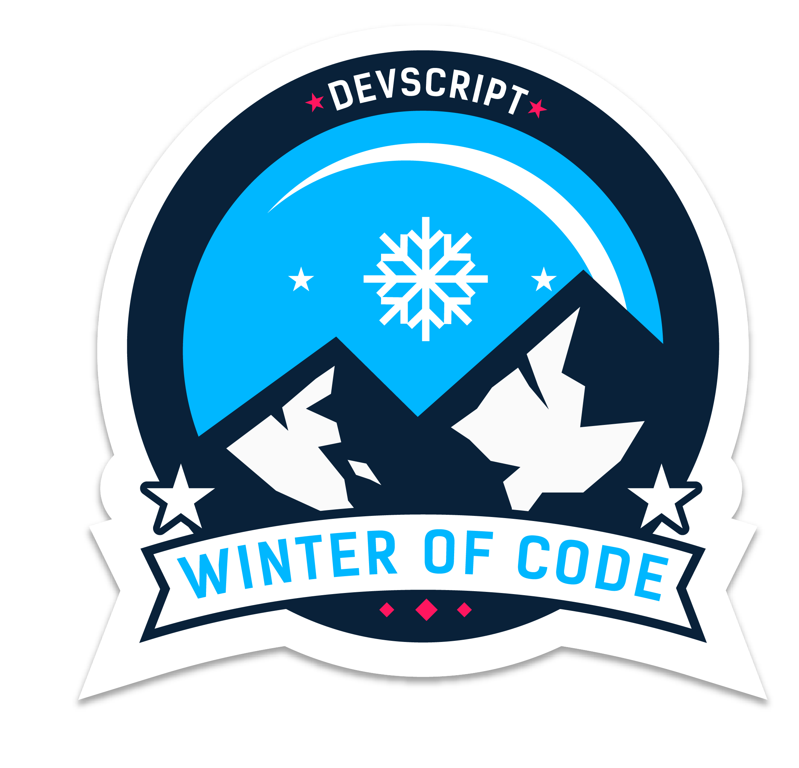

A community maintained open source project aimed at making personal portfolio for researchers, developers and analysts simple, fast and less cumbersome. We make sure you have a full fledged website to showcase your work while you can spend time on your learning and innovative endeavours.

## A sneek peek into what we have here🙈 :

### Home Page:

<p align="center"></p>

### Experience Page:

<p align="center"></p>

### Project Page:

<p align="center"></p>

### Research Page:

<p align="center"></p>

### Education Page:

<p align="center"></p>

## How to use this?🛠

[Check out our awesome Documentation](https://smaranjitghose.github.io/awesome-portfolio-websites/)

## Contribution Guidelines🏗

Are we missing any of your favorite features, which you think you can add to it❓ We invite you to contribute to this project and improve it further

To start contributing, follow the below guidelines:

**1.** Fork [this](https://github.com/smaranjitghose/awesome-portfolio-websites) repository.

**2.** Clone your forked copy of the project.

```
git clone --depth 1 https://github.com/<your_user_name>/awesome-portfolio-websites.git
```


**3.** Navigate to the project directory :file_folder: .

```
cd awesome-portfolio-websites
```

**4.** Add a reference(remote) to the original repository.

```
git remote add upstream https://github.com/smaranjitghose/awesome-portfolio-websites.git
```

**5.** Check the remotes for this repository.

```
git remote -v
```

**6.** Always take a pull from the upstream repository to your master branch to keep it at par with the main project(updated repository).

```
git pull upstream master
```

**7.** Create a new branch.

```
git checkout -b <your_branch_name>
```

**8.** Perform your desired changes to the code base.

<p align="center"></p>

**9.** Track your changes:heavy_check_mark: .

```
git add .
```

**10.** Commit your changes .

```
git commit -m "Relevant message"
```

**11.** Push the committed changes in your feature branch to your remote repo.

```
git push -u origin <your_branch_name>
```

**12.** To create a pull request, click on `compare and pull requests`. Please ensure you compare your feature branch to the desired branch of the repo you are suppose to make a PR to.


**13.** Add appropriate title and description to your pull request explaining your changes and efforts done.

**14.** Click on `Create Pull Request`.


**15** Voila :exclamation: You have made a PR to the awesome-developer-portfolio project :boom: . Sit back patiently and relax while the project maintainers review your PR. Please understand at times the time can vary from a few hours to a few days

<p align="center"></p>

## Project Maintainers👨🏫::

|  |  |  |
| :------------------------------------------------------------------------------------------: | :------------------------------------------------------------------------------------------: | :------------------------------------------------------------: |
|                    [Smaranjit Ghose](https://github.com/smaranjitghose)\*                    |                        [Anush Bhatia](https://github.com/anushbhatia)                        |     [Srividhya Inampudi](https://github.com/sriinampudi)\*     |

\*\* Open Source Day 2021

## Our valuable Contributors👩‍💻👨‍💻 :

<a href="https://github.com/smaranjitghose/awesome-portfolio-websites/graphs/contributors">
  
</a>

## Open Source Programs we have been a part of:

<p align="center">
<a href="https://scodein.tech/"></a>
<a href="https://hakincodes.tech/"></a>
<a href="https://njackwinterofcode.github.io/"></a>
<a href="https://devscript.tech/woc/"></a>
<a href="https://mexili.github.io/winter_of_code/#/"></a>
<a href="https://crosswoc.ieeedtu.in/"></a>
<a href="https://letsgrowmore.in/soc/"></a>
</p>
