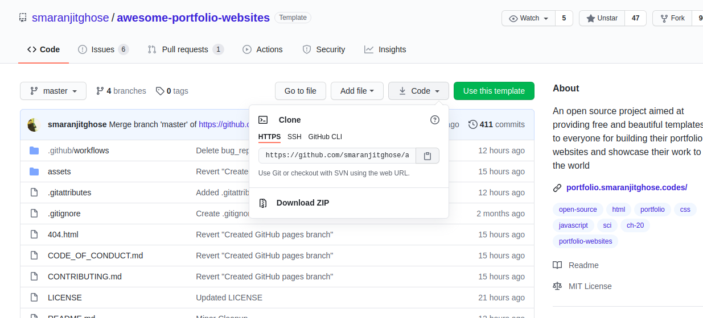
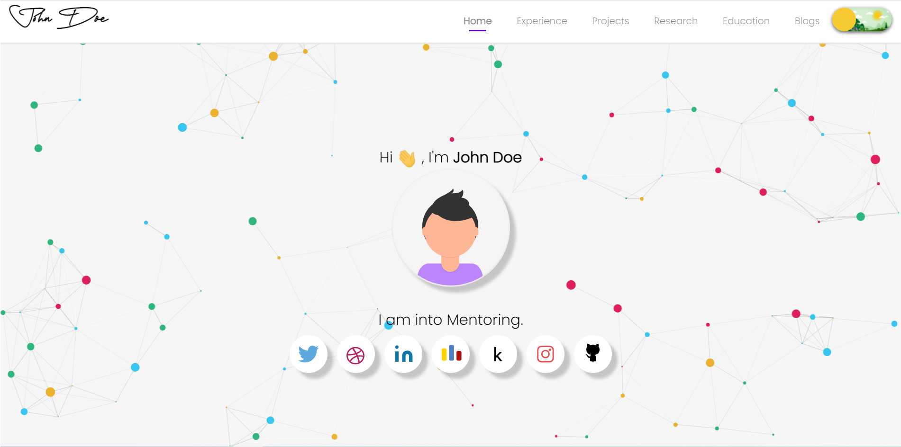
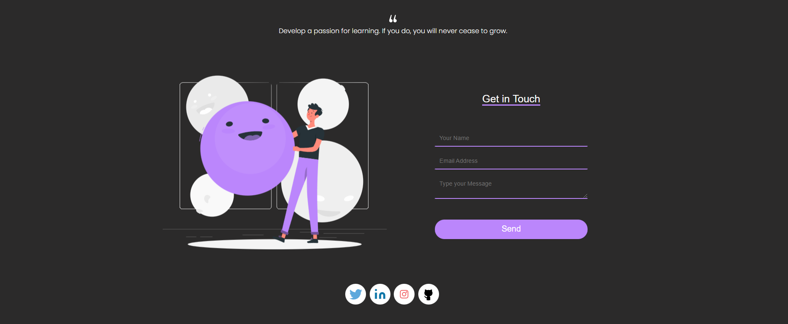
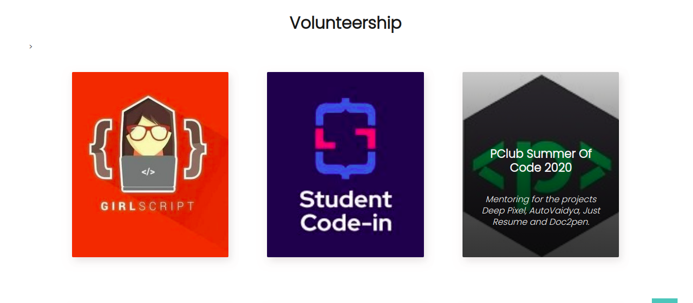
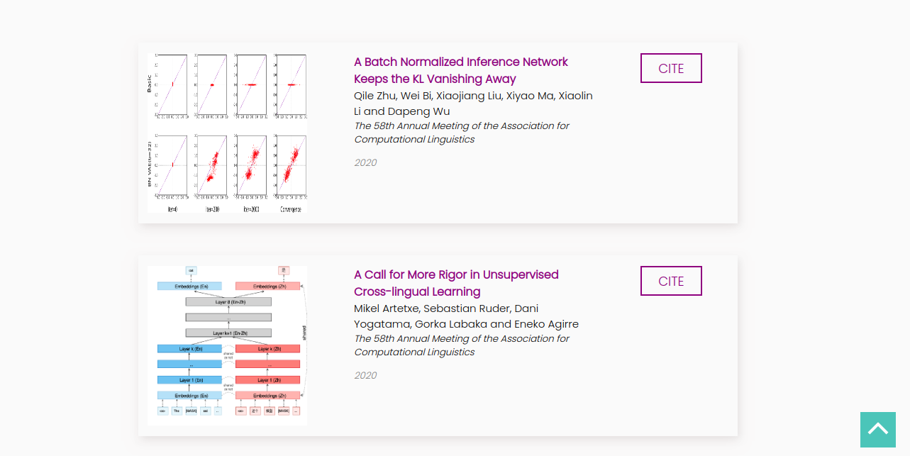
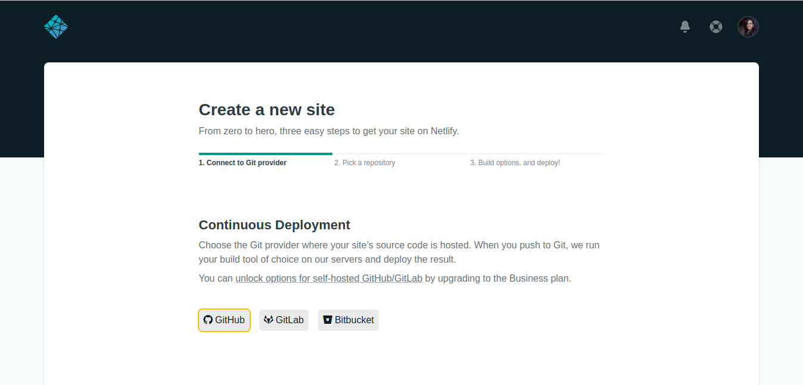
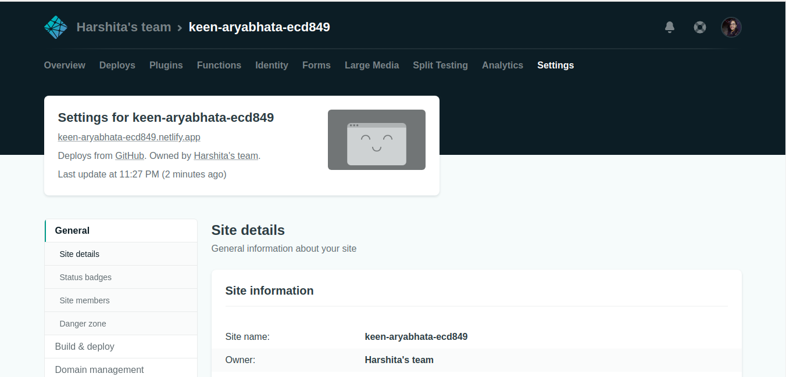

<h1 align="center"><b>Getting Started...</b></h1> 

## Forking the repository

-  Visit the [repository](https://github.com/smaranjitghose/awesome-portfolio-websites.git)

- Fork the repository by clicking on the **Fork** button

## Cloning the repository

- Visit the [repository](https://github.com/smaranjitghose/awesome-portfolio-websites.git)
- Copy the link the of the repository by clicking on the clone button 

- Open terminal 
- Type `git clone https://github.com/smaranjitghose/awesome-portfolio-websites.git`

## Changing the details

### Home Page

- To add your image on the home page :
    1. Add your image to assets -> images folder
    2. Open _index.html_
    3. Change the `` to your image path

- To change the name on home page :
    1. Open _index.html_
    2. Change the name from **John Doe** to **Your Name**

- To change the interests displayed :
    1. Open _index.html_
    2. Inside `h1` tag, change the `data-words` with your interests

- To add your social media links :
    1. Open _index.html_
    2. Inside `
` fill up the link to your social media accounts inside `href`

---

### Navbar

- To change the logo :
    1. Add your logo image inside assets -> images folder
    2. Open _main.js_
    3. Under **Footer and Navbar** heading, inside `<a href="#!" class="brand-logo">`, change the path inside `` to your image path

---

### Footer

- To change the logo :
    1. Open _main.js_
    2. Go to `let footer`, inside `<a class="webintern-footer-logo" href="#">`, change the path inside`` to your image path

- To add your social media links :
    1. Open _main.js_
    2. Inside `
` fill up the link to your social media accounts inside `href`

---

### Experience Page

- To change the **work experience** details :

    1. Add your work experience images to assets -> images -> experience-page folder
    2. Open _experience.js_
    3. Under **Work Experience Cards** heading, 
        1. Change the current **title** to your position inside `title`
        2. Change the current **image path** to your image path inside `cardImage`
        3. Change the current **place** to your industry/company name inside `place`
        4. Change the current **time** to your duration of work inside `time`
        5. Change the current **description** to your job description inside `desp` 

- To change the **volunteership** details :

    1. Add your volunteership work images to assets -> images -> experience-page folder
    2. Open _experience.js_
    3. Under **Volunteership Cards** heading,
        1. Change the current **title** to your organisation name inside `title`
        2. Change the current **image path** to your image path inside `cardImage`
        3. Change the current **description** to your job description inside `description`

- To change the **mentorship** details :

    1. Add your mentorship work images to assets -> images -> experience-page folder
    2. Open _experience.js_
    3. Under **Mentorship Card** heading,
        1. Change the current **title** to your organisation name inside `title`
        2. Change the current **image path** to your image path inside `image`
        3. Change the current **time** to your duration of work inside `time`
        4. Change the current **description** to your work description inside `desp`

---

### Projects Page

- To change the **projects** details :

    1. Add your projects images to assets -> images -> project-page folder
    2. Open _project.js_
    3. Under **Project Cards** heading,
        1. Change the current **title** to your project name inside `title`
        2. Change the current **image path** to your project image path inside `cardImage`
        3. Change the current **description** to your project description inside `description`
        4. Add the **preview link** inside `Previewlink`
        5. Add the **github link** inside `Githublink`

---

### Research Page

- To change the **research** details :

    1. Add your research work images to assets -> images -> research-page folder
    2. Open _research.js_
    3. Under **Research Details Table** heading,
        1. Change the current **title** to your research paper title inside `title`
        2. Change the current **authors** to your research paper authors inside `authors`
        3. Change the current **conferences** to your research conferences inside `authors`
        4. Change the current **research year** to your research year inside `researchYr`
        5. Change the current **image path** to your image path inside `image`
        6. Change the current **vancouver** to yours inside `vancouver`
        7. Change the current **bibtex** to yours inside `bibtex`

---

### Education Page

- To change the **formal education** details :

    1. Add your institute images to assets -> images -> education-page folder
    2. Open _education.js_
    3. Under **Timeline Section** heading,
        1. Change the current **title** to your institute name inside `heading`
        2. Change the current **image path** to your image path inside `image`
        3. Change the current **sub heading** to yours inside `subheading`
        4. Change the current **description** to yours inside `description`

- To change the **mooc section** details :

    1. Add your MOOCs images to assets -> images -> education-page folder
    2. Open _education.js_
    3. Under **MOOCs Cards** heading,
        1. Change the current **title** to your course name inside `title`
        2. Change the current **image path** to your course image path inside `cardImage`
        3. Change the current **MOOC link** to yours inside `moocLink`

- To change the **badges section** details :

    1. Add your badges' images to assets -> images -> education-page folder
    2. Open _education.js_
    3. Under **Badges** heading,
        1. Change the current **badge title** to yours inside `title`
        2. Change the current **image path** to your badge image path inside `image`
        3. Change the current **description** to yours inside `description`

## SEO and Miscellaneous

- Search for `site_name` and update it to the link to your portfolio

- Search for `title` and update it from `John Doe | Home` to `Your Name | Home`

- Search for `description` and update by writing something about yourself

- Search for `url` and update it to the link to your portfolio

- Search for `site` and again update it to the link to your portfolio

- Search for `application-name` and update it from `John Doe | Home` to `Your Name | Home`

- Search for `apple-mobile-web-app-title` and update it from `John Doe | Home` to `Your Name | Home`

- Search for `summary` and update it by writing somthing about yourself

## Final Steps

- After making all the changes, now it's time to push these changes to your local repository. For this, steps to be followed are :

    - Save the changes you have made till now
    
    - Open terminal in the file you made the changes

    - Type `git add .`

    - Then type `git commit -m "Your commit message"`

    - Then finally, `git push origin master`

## Hosting

### Netlify

- Sign in to your netlify account or sign up if you don't have an account

- Click on **New Site From Git** button

- Select **Github** option button

- Authorize Netlify 

- Select the repository

- Configure your settings and click on **Deploy Site** button

- Netlify will automatically generate a link for your deploy. If you wish to change the link name, click on **Change Site Name** button and change the link name.

---

### GitHub Pages

- As we have already created a repository and pushed the changes, all we need to do now is **rename the repository** to `your_username.github.io`

- To rename, open your repository, and go to settings and click on **rename** button

- And your website will be hosted on GitHub!!

---

### AWS Amplify

- Sign in to your AWS account or sign up if you don't have one already

- Select GitHub option to **connect to your GitHub Repository** and click **Continue**

- Add the **repository branch**

- **Configure the build settings** and click on **Save and Deploy**

--- 

### Custom domain name for GitHub Pages

- For setting up custom domain name with ANAME/CNAME files with github pages, follow the following steps :

    

    - Open the repository, go to settings under **GitHub Pages** heading, go to **Custom Domain** column, set your custom domain for the project _(this will create a CNAME file in the same repository. Don't delete it)_

    

    - Set `A` and `CNAME` records for the selected domain. For `A` record, set `185.199.108.153`, `185.199.109.153`, `185.199.110.153` and `185.199.111.153`. To redirect `www` subdomain to the original domain, add a `CNAME` record with your **GitHub pages profile URL with a .(dot) in the end**, for example, `‘YOUR-GITHUB-USERNAME.github.io.’`.
