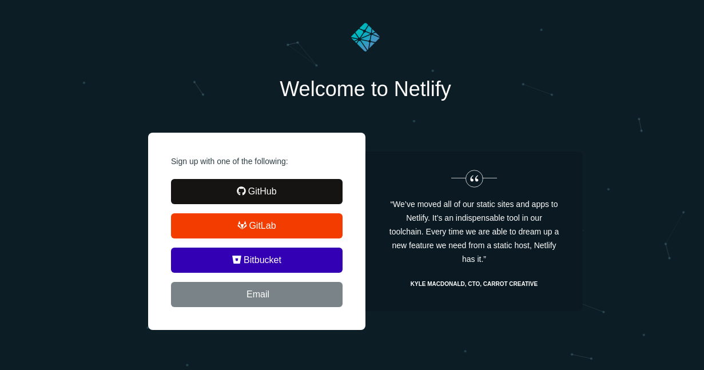
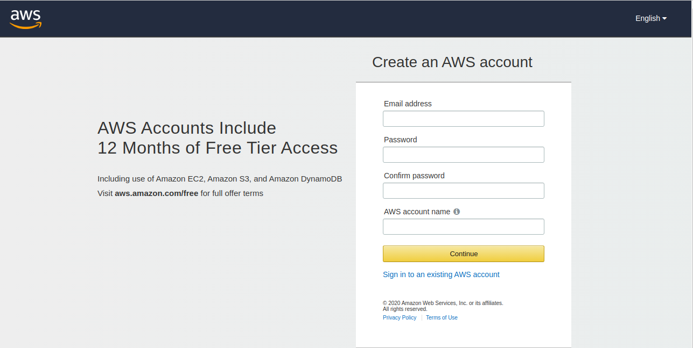

# **Hosting your Postfolio On Cloud** {: style="text-align: center"}

## Netlify

- Sign in to your netlify account or sign up if you don't have an account

- Click on **New Site From Git** button

- Select **Github** option button

- Authorize Netlify

- Select the repository

- Configure your settings and click on **Deploy Site** button

- Netlify will automatically generate a link for your deploy. If you wish to change the link name, click on **Change Site Name** button and change the link name.

---

## GitHub Pages

- As we have already created a repository and pushed the changes, all we need to do now is **rename the repository** to `your_username.github.io`

- To rename, open your repository, and go to settings and click on **rename** button

- And your website will be hosted on GitHub!!

### Custom domain name for GitHub Pages

- For setting up custom domain name with ANAME/CNAME files with github pages, follow the following steps :

    

    - Open the repository, go to settings under **GitHub Pages** heading, go to **Custom Domain** column, set your custom domain for the project _(this will create a CNAME file in the same repository. Don't delete it)_

    

    - Set `A` and `CNAME` records for the selected domain. For `A` record, set `185.199.108.153`, `185.199.109.153`, `185.199.110.153` and `185.199.111.153`. To redirect `www` subdomain to the original domain, add a `CNAME` record with your **GitHub pages profile URL with a .(dot) in the end**, for example, `‘YOUR-GITHUB-USERNAME.github.io.’`.

---

## AWS Amplify

- Sign in to your AWS account or sign up if you don't have one already

- Select GitHub option to **connect to your GitHub Repository** and click **Continue**

- Add the **repository branch**

- **Configure the build settings** and click on **Save and Deploy**

---