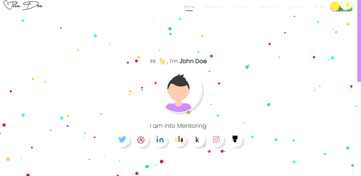
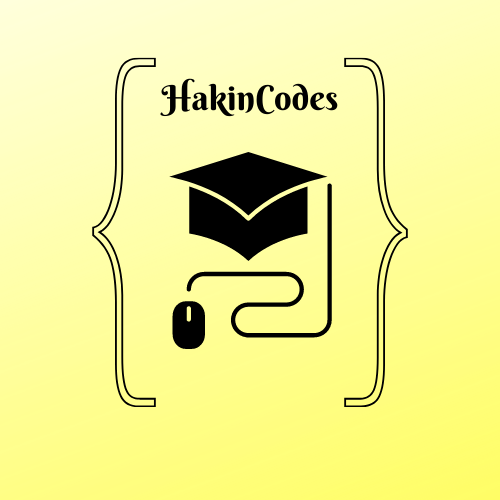
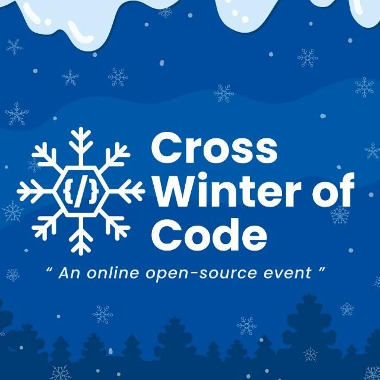
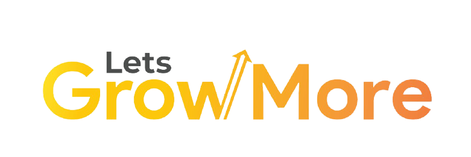

# Welcome to Awesome Portfolio Website😎

An **open source project for creating end-end templates for portfolio websites** for everyone to use. We are a clan of geeks who wants to provide you with that _dope website that flaunts your hardwork and projects_ over the years to your mates and employers! With a deep desire to have that **satiating UI**, those **engaging animations**,the **great SEO** and the **optimized code**, we do it all. Hop in and give your contributions if you wish to be a part of this initiative.

### Home Page

### Experience Page

### Project Page

### Research Page

### Education Page

---

## Code Of Conduct

### Our Pledge {: style="color: #E0B0FF"}

In the interest of fostering an open and welcoming environment, we as contributors and maintainers pledge to making participation in our project and our community a harassment-free experience for everyone, regardless of age, body size, disability, ethnicity, sex characteristics, gender identity and expression, level of experience, education, socio-economic status, nationality, personal appearance, race, religion, or sexual identity and orientation.

### Our Standards {: style="color: #E0B0FF"}

Examples of behavior that contributes to creating a positive environment include:

- Using welcoming and inclusive language
- Being respectful of differing viewpoints and experiences
- Gracefully accepting constructive criticism
- Focusing on what is best for the community
- Showing empathy towards other community members

### Our Responsibilities {: style="color: #E0B0FF"}

Project maintainers are responsible for clarifying the standards of acceptable behavior and are expected to take appropriate and fair corrective action in response to any instances of unacceptable behavior.

Project maintainers have the right and responsibility to remove, edit, or reject comments, commits, code, wiki edits, issues, and other contributions that are not aligned to this Code of Conduct, or to ban temporarily or permanently any contributor for other behaviors that they deem inappropriate, threatening, offensive, or harmful.

### Scope {: style="color: #E0B0FF"}

This Code of Conduct applies both within project spaces and in public spaces when an individual is representing the project or its community. Examples of representing a project or community include using an official project e-mail address, posting via an official social media account, or acting as an appointed representative at an online or offline event. Representation of a project may be further defined and clarified by project maintainers.

### Enforcement {: style="color: #E0B0FF"}

Instances of abusive, harassing, or otherwise unacceptable behavior may be reported by contacting the project team at [smaranjitghose@protonmail.com](smaranjitghose@protonmail.com). All complaints will be reviewed and investigated and will result in a response that is deemed necessary and appropriate to the circumstances. The project team is obligated to maintain confidentiality with regard to the reporter of an incident. Further details of specific enforcement policies may be posted separately.

Project maintainers who do not follow or enforce the Code of Conduct in good faith may face temporary or permanent repercussions as determined by other members of the project's leadership.

### Attribution {: style="color: #E0B0FF"}

This Code of Conduct is adapted from the [Contributor Covenant](https://www.contributor-covenant.org/), version 1.4, available at [https://www.contributor-covenant.org/version/1/4/code-of-conduct.html](https://www.contributor-covenant.org/version/1/4/code-of-conduct.html)

For answers to common questions about this code of conduct, see [https://www.contributor-covenant.org/faq](https://www.contributor-covenant.org/faq)

---

**_In open source, we feel strongly that to really do something well, you have to get a lot of people involved._**{: style="font-size: 1.15rem;"}
 _-Linus Torvalds_{: style="float: right; margin-top: 1.5em; font-size:1rem"}

---

## LICENSE

### MIT License {: style="color: #E0B0FF"}

Copyright (c) 2020 Smaranjit Ghose

Permission is hereby granted, free of charge, to any person obtaining a copy
of this software and associated documentation files (the "Software"), to deal
in the Software without restriction, including without limitation the rights
to use, copy, modify, merge, publish, distribute, sublicense, and/or sell
copies of the Software, and to permit persons to whom the Software is
furnished to do so, subject to the following conditions:

The above copyright notice and this permission notice shall be included in all
copies or substantial portions of the Software.

THE SOFTWARE IS PROVIDED "AS IS", WITHOUT WARRANTY OF ANY KIND, EXPRESS OR
IMPLIED, INCLUDING BUT NOT LIMITED TO THE WARRANTIES OF MERCHANTABILITY,
FITNESS FOR A PARTICULAR PURPOSE AND NONINFRINGEMENT. IN NO EVENT SHALL THE
AUTHORS OR COPYRIGHT HOLDERS BE LIABLE FOR ANY CLAIM, DAMAGES OR OTHER
LIABILITY, WHETHER IN AN ACTION OF CONTRACT, TORT OR OTHERWISE, ARISING FROM,
OUT OF OR IN CONNECTION WITH THE SOFTWARE OR THE USE OR OTHER DEALINGS IN THE
SOFTWARE.

---

## Open Source Programs we have been associated with {: align="center""}

{: style="height:11rem;width:11rem; margin:10px;"}
{: style="height:11rem;width:11rem; margin:10px;"}
{: style="height:11rem;width:11rem; margin:10px;"}
{: style="height:11rem;width:11rem; margin:10px;"}
{: style="height:11rem;width:11rem; margin:10px;"}
{: style="height:11rem;width:11rem; margin:10px;"}
{: style="height:11rem;width:11rem; margin:10px;"}
{: style="height:11rem;width:11rem; margin:10px;"}
{: style="height:11rem;width:13rem; margin:10px;"}
