# Team {: style="text-align: center"}

## **_Coming together is a BEGINNING,_** {: style="text-align: center"}
## **_Staying together is PROGRESS_** {: style="text-align: center"}
## **_and working together is SUCCESS_** {: style="text-align: center"}
 _-Henry Ford_{: style="float: right; margin-top: -1em"}

# Project Maintainers {: style="text-align: center; margin-top: 3em"}

{: style="width: 40%;margin-left: 3em"}
{: style="width: 40%; margin-left: 3em"}

[Smaranjit Ghose](https://github.com/smaranjitghose){: style="font-weight:bold; margin-left:8.5em"}
[Anush Bhatia](https://github.com/anushbhatia){: style="font-weight:bold; margin-left:8.5em"}

# Contributors {: style="text-align: center; margin-top: 3em"}

{: style="width: 30%; padding-right: 3em; padding-bottom:1.5em"}
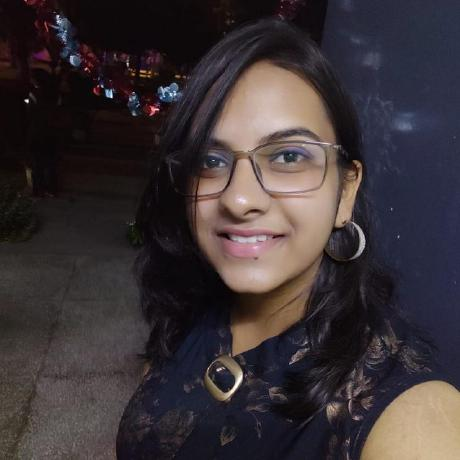{: style="width: 30%; padding-right: 3em; padding-bottom:1.5em"}
{: style="width: 30%; padding-right: 3em; padding-bottom:1.5em"}
{: style="width: 30%; padding-right: 3em; padding-bottom:1.5em"}
{: style="width: 30%; padding-right: 3em; padding-bottom:1.5em"}
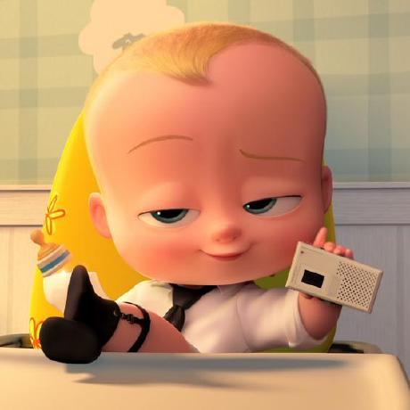{: style="width: 30%; padding-right: 3em; padding-bottom:1.5em"}
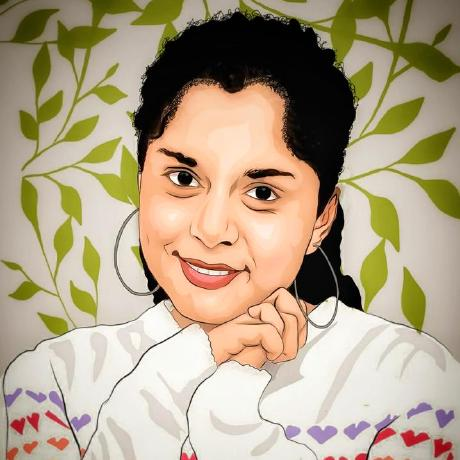{: style="width: 30%; padding-right: 3em; padding-bottom:1.5em"}
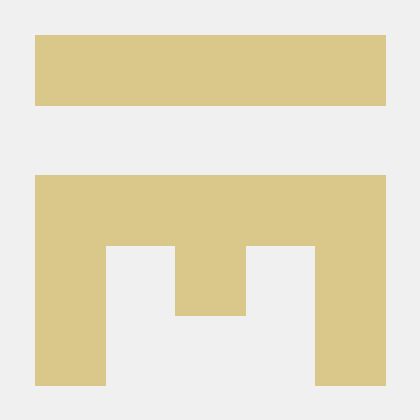{: style="width: 30%; padding-right: 3em; padding-bottom:1.5em"}
{: style="width: 30%; padding-right: 3em; padding-bottom:1.5em"}
{: style="width: 30%; padding-right: 3em; padding-bottom:1.5em"}
{: style="width: 30%; padding-right: 3em; padding-bottom:1.5em"}
{: style="width: 30%; padding-right: 3em; padding-bottom:1.5em"}
{: style="width: 30%; padding-right: 3em; padding-bottom:1.5em"}
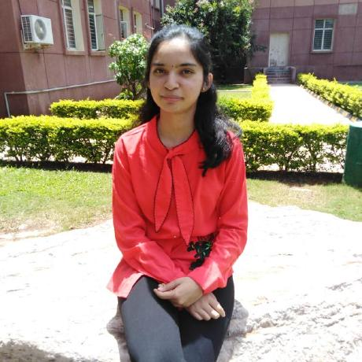{: style="width: 30%; padding-right: 3em; padding-bottom:1.5em"}
{: style="width: 30%; padding-right: 3em; padding-bottom:1.5em"}
{: style="width: 30%; padding-right: 3em; padding-bottom:1.5em"}
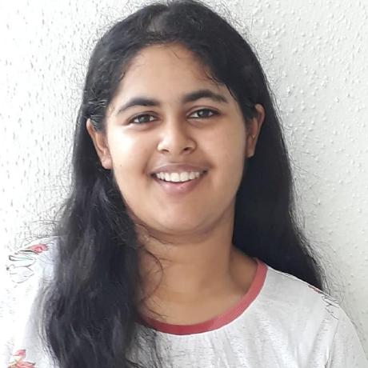{: style="width: 30%; padding-right: 3em; padding-bottom:1.5em"}
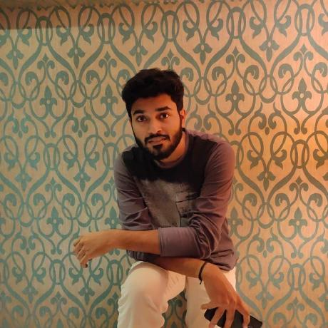{: style="width: 30%; padding-right: 3em; padding-bottom:1.5em"}
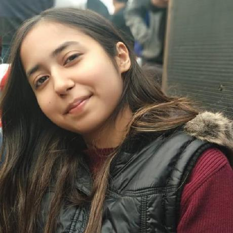{: style="width: 30%; padding-right: 3em; padding-bottom:1.5em"}
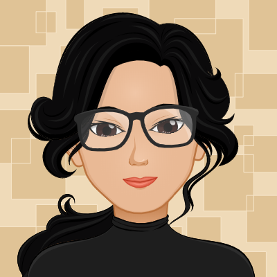{: style="width: 30%; padding-right: 3em; padding-bottom:1.5em"}
{: style="width: 30%; padding-right: 3em; padding-bottom:1.5em"}
{: style="width: 30%; padding-right: 3em; padding-bottom:1.5em"}
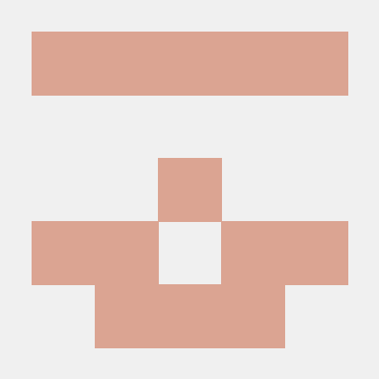{: style="width: 30%; padding-right: 3em; padding-bottom:1.5em"}
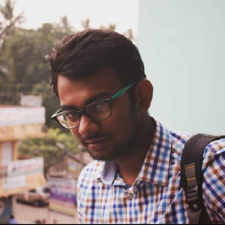{: style="width: 30%; padding-right: 3em; padding-bottom:1.5em"}
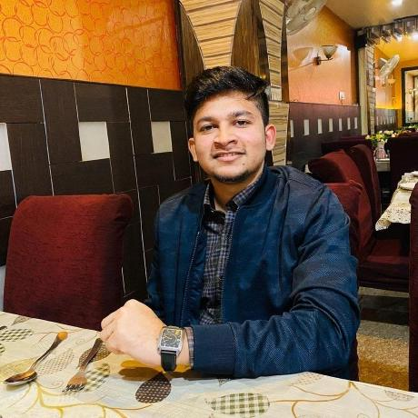{: style="width: 30%; padding-right: 3em; padding-bottom:1.5em"}