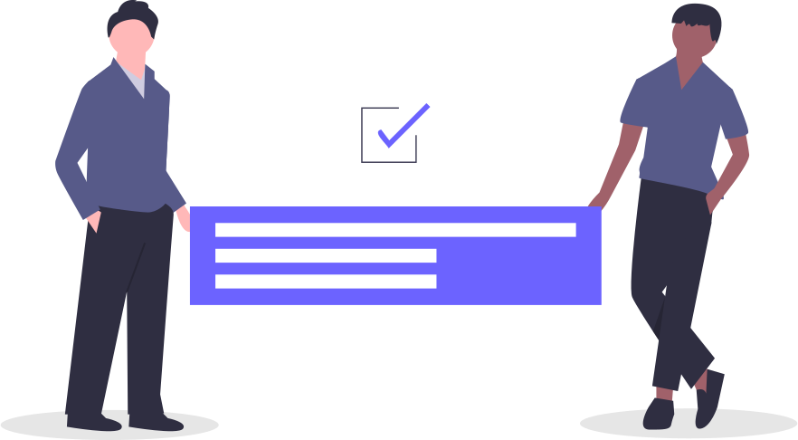

# **Team** {: style="text-align: center"}

 

**_Coming together is a BEGINNING,_**{:style="text-align: center; display:block; margin:auto; font-size:1.2em"}  
**_Staying together is PROGRESS_**{: style="text-align: center; display:block; margin:auto; font-size:1.2em"}  
**_and working together is SUCCESS_**{: style="text-align: center; display:block; margin:auto; font-size:1.2em"}  
 _-Henry Ford_{: style="float: right; font-size:1.3em; margin-top: -1em"}

# Project Maintainers {: style="text-align: center; margin-top: 3em"}

[{: style="width: 40%;margin-left: 3em"}](https://github.com/smaranjitghose)
[{: style="width: 40%; margin-left: 3em"}](https://github.com/anushbhatia)

[Smaranjit Ghose](https://github.com/smaranjitghose){: style="font-weight:bold; margin-left:8.5em"}
[Anush Bhatia](https://github.com/anushbhatia){: style="font-weight:bold; margin-left:8.5em"}

# Contributors {: style="text-align: center; margin-top: 3em"}

